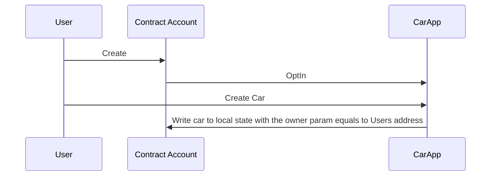
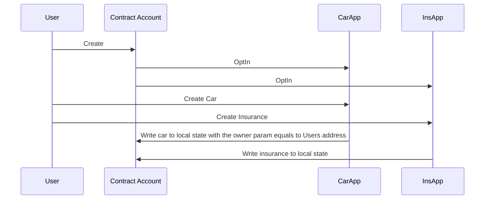
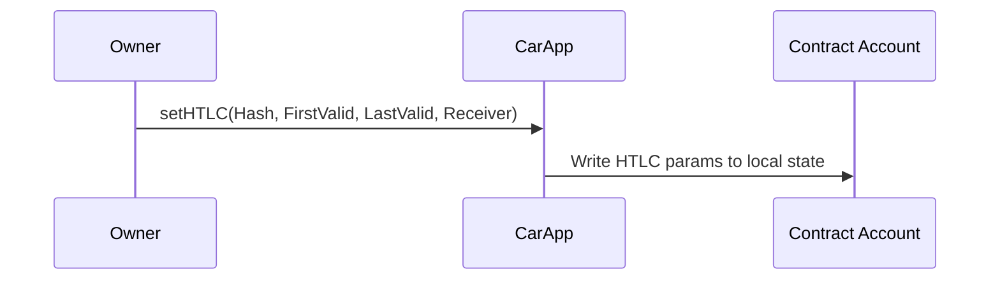
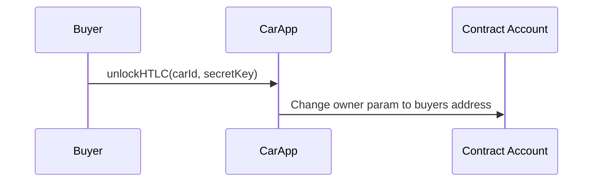

# Algorand Car Insurance dApp

To test the dApp clone the project,

Install ```AlgoSigner``` web extension
``` npm install ``` in POC/frontEnd then ```npm start```


# Algorand Smart Contracts

There are two smart contract type **Stateless** and **Stateful** contracts. **Stateless** contracts does not live on chain. **Stateless** contracts are used for signing transactions with the logic of the program this operation is called **LogicSig**. **Stateless** contracts creates an contract account when you compile them and this contract account is similar to normal account. Only difference is normal accounts sign their transactions with their private key but in contract account program logic signs the transaction. **Stateful** contracts lives on chain and can have global and local states. Users can change global or local state by interacting with the app via sending application call transaction. But for each account using the application that writes to a local state of the account, that account must be opted in to the application. **Stateful** contracts can store at most 64 key-value pairs in their global state and at most 16 key-value pairs in local state. Every **stateful** app consist of two program, **approval program** and **clear program**. **Approval program** approve the transaction if logic returns true with the given parameters. **Clear program** clears the local state of the txn sender  for that application. Algorand smart contracts are written in **TEAL(Transaction Execution Approval Language)**. Developers can also use **pyTeal** but they both programmed in the same logic and **pyTeal** compiles to **TEAL** at the end. Also there is another language that supports programming ASC1 it is called **Reach** and it is easy to use js like language but still it is compiled to **TEAL**.  **TEAL** is an assembly like stack based language. Read/Write to chain is held by **AlgodClient** and **IndexerClient** from **js-algorand-sdk**  using AlgoExplorer Apis in this project. There are sdk support for many other languages.

# dApp Structure
As mentioned above local and global storage is limited. To store as many cars as we wish each car is represented as a contract account that opted-in to our car application. Owner field in contract account refers to the owner of the car. Also for insurance creation that contract account must optin to insurance app then insurance app writes insurance to the local state of the Car Account (Contract Account).


**AddCar**

**AddCarWithInsurance**
Create Car and Insurance txns sent as grouped txn

**ChangeOwner**

Set HTLC


Unlock HTLC
